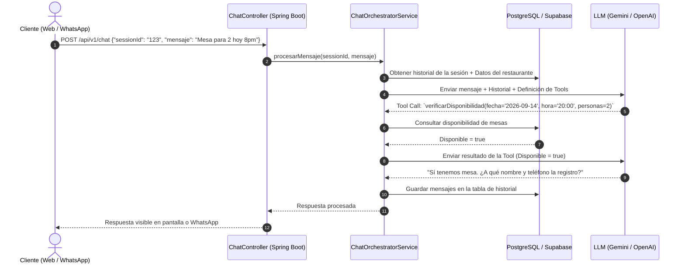

# Arquitectura y Funcionamiento de la API (Spring Boot 3)

Este documento detalla el diseño técnico del backend en **Java Spring Boot 3** para el sistema de asistente IA de restaurantes y servicios.

---

## 1. Rol de la API: El "Director de Orquesta"

La API de Spring Boot no inventa respuestas por su cuenta; actúa como el intermediario inteligente y seguro que coordina a tres entidades:
1. **El Cliente:** Usuario que escribe desde el Widget Web o desde WhatsApp.
2. **El Proveedor de IA (Gemini / OpenAI):** Procesa el lenguaje natural y razona qué hacer.
3. **La Base de Datos (PostgreSQL / Supabase):** Fuente única de la verdad con los datos reales del negocio (menú, precios, disponibilidad y reservas).

```text
[ Cliente: Web o WhatsApp ]
            │
            ▼
┌───────────────────────────────┐
│ 1. CONTROLLERS                │ ── Reciben peticiones HTTP
│  • ChatController (/chat)     │
│  • WhatsAppWebhookController  │
└──────────────┬────────────────┘
               │
               ▼
┌───────────────────────────────┐
│ 2. ORCHESTRATOR SERVICE       │ ── Cerebro intermediario:
│  • ChatOrchestratorService    │    - Carga historial
│  • PromptBuilderService       │    - Habla con OpenAI / Gemini
└──────────────┬────────────────┘    - Ejecuta las "Tools"
               │
      ┌────────┴────────┐
      ▼                 ▼
┌──────────────┐  ┌───────────────────────────────┐
│ 3. IA CLIENT │  │ 4. REPOSITORIES & DATABASE    │
│  (Gemini /   │  │  • RestaurantRepository       │
│   OpenAI)    │  │  • MenuRepository             │
└──────────────┘  │  • ReservationRepository      │
                  │  • MessageHistoryRepository   │
                  └───────────────────────────────┘
```

---

## 2. El Mecanismo Clave: Function Calling (Tools)

Para evitar alucinaciones (que la IA invente platillos o confirme reservas sin haber mesas), el sistema implementa **Function Calling**:

1. En Spring Boot se declaran métodos Java que se exponen como herramientas al modelo de IA:
   - `consultarMenu(categoria, busqueda)`
   - `verificarDisponibilidad(fecha, hora, personas)`
   - `crearReserva(nombre, telefono, fecha, hora, personas, notas)`
2. Al enviarle el mensaje a la IA, Spring Boot adjunta la descripción de estas herramientas.
3. Si la IA detecta que el usuario quiere reservar o preguntar por comida, la IA **no inventa una respuesta**, sino que le responde a Spring Boot: *"Por favor ejecuta la función `verificarDisponibilidad` con estos parámetros..."*.
4. Spring Boot ejecuta la consulta real en PostgreSQL y le retorna el resultado a la IA para que esta elabore la respuesta final al cliente.

---

## 3. Diagrama de Secuencia (Paso a Paso)



---

## 4. Estructura de Capas en Spring Boot

### 1. Controladores (`com.nexo.controller`)
- **`ChatController`**: Expone `POST /api/v1/chat`. Recibe `sessionId` y `message`. Utilizado principalmente por el widget web.
- **`WhatsAppWebhookController`**:
  - `GET /api/v1/webhook/whatsapp`: Valida el token de verificación exigido por Meta Cloud API.
  - `POST /api/v1/webhook/whatsapp`: Recibe notificaciones de mensajes entrantes desde WhatsApp.

### 2. Servicios de Orquestación (`com.nexo.service`)
- **`ChatOrchestratorService`**: Núcleo del sistema. Coordina el flujo completo:
  - Recupera y almacena mensajes de la conversación.
  - Prepara el System Prompt con las reglas de negocio (horarios, políticas, promociones activas).
  - Gestiona las llamadas de ida y vuelta con la IA cuando hay ejecución de funciones.
- **`ReservationService`**: Contiene la lógica de negocio para validar horarios, cupos y crear reservas.
- **`MenuService`**: Búsqueda y filtrado de platillos o servicios disponibles.

### 3. Herramientas de IA (`com.nexo.ai.tools`)
- Clases que definen los esquemas de parámetros esperados por la IA e invocan a los servicios correspondientes (`ReservationTools`, `MenuTools`).

### 4. Persistencia JPA (`com.nexo.repository` y `com.nexo.model`)
- Entidades mapeadas con Hibernate para interactuar de forma segura con PostgreSQL.

---

## 5. Soporte Multicanal (Mismo Cerebro, Diferentes Canales)

Una de las grandes ventajas de este diseño es que **la lógica de negocio se programa una sola vez**:
- Si el usuario habla por la **Web**: El frontend llama al endpoint REST y recibe el JSON directamente.
- Si el usuario habla por **WhatsApp**: El webhook recibe el mensaje de Meta, llama exactamente al mismo servicio `ChatOrchestratorService`, y envía la respuesta de vuelta a la API de WhatsApp de Meta.

Ambos canales comparten la misma base de datos, el mismo menú y el mismo motor de reservaciones.
