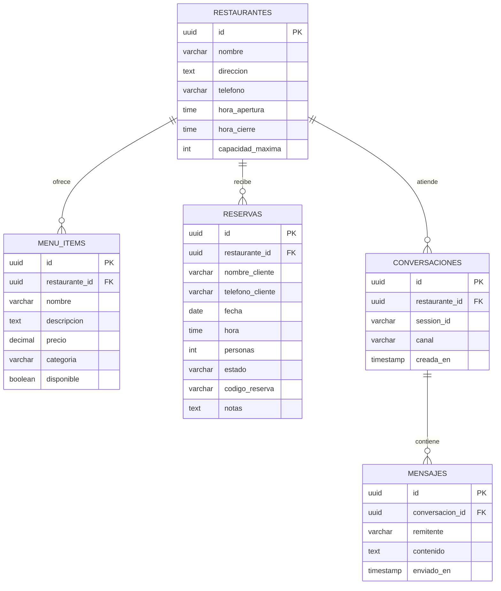

# Modelo de Base de Datos (PostgreSQL / Supabase)

Este documento contiene el diseño de las tablas necesarias para operar el asistente inteligente en **PostgreSQL / Supabase** mediante JPA/Hibernate.

---

## 1. Diagrama Entidad-Relación (Conceptual)



---

## 2. Definición DDL (SQL para PostgreSQL / Supabase)

Puedes ejecutar este script directamente en el SQL Editor de Supabase o en tu PostgreSQL local:

```sql
-- 1. Extensión para UUIDs automáticos
CREATE EXTENSION IF NOT EXISTS "uuid-ossp";

-- 2. Tabla de Restaurantes o Negocios
CREATE TABLE IF NOT EXISTS restaurantes (
    id UUID PRIMARY KEY DEFAULT uuid_generate_v4(),
    nombre VARCHAR(150) NOT NULL,
    direccion TEXT,
    telefono VARCHAR(30),
    hora_apertura TIME NOT NULL DEFAULT '12:00:00',
    hora_cierre TIME NOT NULL DEFAULT '23:00:00',
    capacidad_maxima INT NOT NULL DEFAULT 50,
    creado_en TIMESTAMP WITH TIME ZONE DEFAULT NOW()
);

-- 3. Tabla de Menú / Servicios
CREATE TABLE IF NOT EXISTS menu_items (
    id UUID PRIMARY KEY DEFAULT uuid_generate_v4(),
    restaurante_id UUID REFERENCES restaurantes(id) ON DELETE CASCADE,
    nombre VARCHAR(150) NOT NULL,
    descripcion TEXT,
    precio NUMERIC(10, 2) NOT NULL,
    categoria VARCHAR(80) NOT NULL, -- ej: 'Entradas', 'Platos Fuertes', 'Bebidas', 'Postres'
    disponible BOOLEAN DEFAULT TRUE,
    creado_en TIMESTAMP WITH TIME ZONE DEFAULT NOW()
);

-- 4. Tabla de Reservaciones
CREATE TABLE IF NOT EXISTS reservas (
    id UUID PRIMARY KEY DEFAULT uuid_generate_v4(),
    restaurante_id UUID REFERENCES restaurantes(id) ON DELETE CASCADE,
    nombre_cliente VARCHAR(120) NOT NULL,
    telefono_cliente VARCHAR(40) NOT NULL,
    fecha DATE NOT NULL,
    hora TIME NOT NULL,
    personas INT NOT NULL CHECK (personas > 0),
    estado VARCHAR(30) DEFAULT 'CONFIRMADA', -- 'PENDIENTE', 'CONFIRMADA', 'CANCELADA'
    codigo_reserva VARCHAR(20) UNIQUE NOT NULL,
    notas TEXT,
    creado_en TIMESTAMP WITH TIME ZONE DEFAULT NOW()
);

-- 5. Tabla de Conversaciones (Sesiones)
CREATE TABLE IF NOT EXISTS conversaciones (
    id UUID PRIMARY KEY DEFAULT uuid_generate_v4(),
    restaurante_id UUID REFERENCES restaurantes(id) ON DELETE CASCADE,
    session_id VARCHAR(120) UNIQUE NOT NULL, -- UUID de web o número de teléfono en WhatsApp
    canal VARCHAR(30) NOT NULL,              -- 'WEB' o 'WHATSAPP'
    creada_en TIMESTAMP WITH TIME ZONE DEFAULT NOW()
);

-- 6. Tabla de Mensajes (Historial para la IA)
CREATE TABLE IF NOT EXISTS mensajes (
    id UUID PRIMARY KEY DEFAULT uuid_generate_v4(),
    conversacion_id UUID REFERENCES conversaciones(id) ON DELETE CASCADE,
    remitente VARCHAR(20) NOT NULL,          -- 'USER', 'ASSISTANT', 'SYSTEM'
    contenido TEXT NOT NULL,
    enviado_en TIMESTAMP WITH TIME ZONE DEFAULT NOW()
);

-- Índices recomendados para alta velocidad en consultas
CREATE INDEX IF NOT EXISTS idx_menu_categoria ON menu_items(categoria);
CREATE INDEX IF NOT EXISTS idx_reservas_fecha_hora ON reservas(fecha, hora);
CREATE INDEX IF NOT EXISTS idx_mensajes_conversacion ON mensajes(conversacion_id, enviado_en ASC);
```
